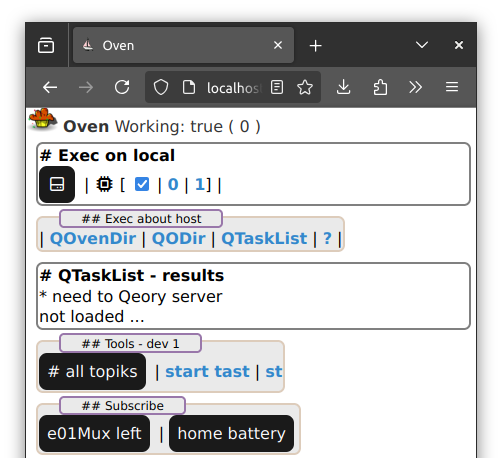
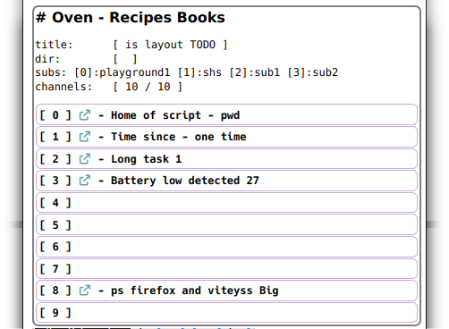
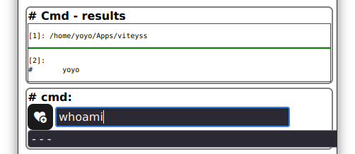
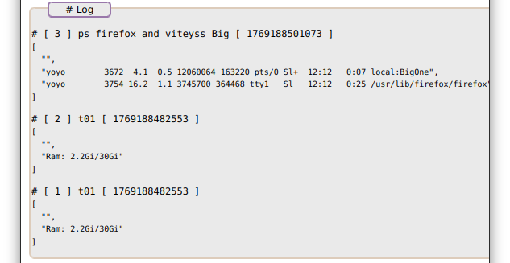
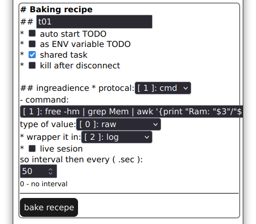

# viteyss-site-oven

 Oven is a define recipe / 
set ingreadiance / post-process / wrap it ... Bakeing place 

gui for bash with some rerouting.

## what it solves for me

N number of lost / forgotten / misplaced scripts and tasks can be in one place. 
Rapid / ascii / directory / link base system for configuration.

So Cook Book holds sets of recipes. For something what I want / need to do. 

* bash can have graphical output `out of the box`

* instance execution of your recipe

* fast command test place 

* CookBook local cmd history / favorite

* ...

### Bakeing recipe

Recipe can be Baked in oven as one shot or long time live process.

stdio is main source of data sourcing for next step

`chunks` or `blocks` of result of text can be postProcess as 

```info
[A] - [ ] asci posible to worki in terminal and web
[W] - [ ] web browser version
```

* [A] `raw` - array line by line of result or chunks

* [x] [A] `toString` - to string join with `\n`

* [A] `secLeft` - sec left / since 

* [W] `percent` - `jQuery` donuts like visualization

* [W] `percent bar` - `html` progress bar 

* [x] [A] `progress bar ascii` - `ascii` progress bar 

* ...

Wrapping if get array will run line by line with define process. But if it's numerical operation then on error conversion return line as is.

Then it's passing it to wrapping section ...

### wrapping it

It's possible to set recipe that it can wrap product in a:

* [W] `toast` - temporary popup on screen in corner

* `external x-terminal-emulator`

* [W] `log`

* [ ] widget / channel of recipe it self ( almost ) 
- [x] to `setENV` as data handle - as `TagsColector`

- [ ] to `getENV` as input from data handles on change

- [ ] to trigger other channel - setting name of setENV to CookBook adressUrl / chN ?

#### screenshoot

####### ver 26012x ... state chaos working

 Top part with some custom debug 
action buttons end debug links as it's work in progress.





 Log of iterative 
recipe Ram use / total Gi from `free`



#### CookBook 's

Since there is working CookBook 's swapping option. In allows now to have 
unlimited depth and sets of recipes. All the power coming with file 
system of linux: directories, files, links, fifo, ... is access able as element 
of configuration of next CookBook.

- [x] swapping CookBook 's

- [ ] keyMap - keyBindings

###### default installation:

It comses with some presets to start with creating your own e

root CookBook - debug scripts to start ....

- battery alert if battery to low show toast

- button to add record to database

- system notification ( gnome or make recipe with args )

oWin - window oven manager

###### Oven look - layouts

- [x] Default oven - layout

- [ ] svg 

- [ ] tui - blessed

- [x] Oven Modes: [ `view` , `cmd` , `edit` , `debug` ]

#### xdoc

Started Beaking recipe is getting some ENV variables to help it to do the things ..

- [x] set ENV on run time, prefix `oven_`:
  
  - [x] `oven_home` - ~/.viteyss/oven
  
  - [x] `oven_adressURL` - CookBook adress from `oven_home`
  
  - [x] `oven_my_chNo`
  
  - [x] `oven_my_rName`

- [x] `onModeSwith(targetModeName, onDone )` - to prompt and to add to history

#### notes

- [x] make it `invoike listener of ENV`
  - [x] api_oven now CMD b64 is wrapt first in `encodeURIComponent` then `btoa`
  - [ ] OvENVView can not do reroute of 
    - [ ]     - [x] builds connection tree
    - [x] calls channel on `reroutENV( data, recipe )`
    - [ ] need more work with passing on all wrappers no work ok widget

#### 260130.2

make it `invoike listener of ENV`

- [x] api_oven now CMD b64 is wrapt first in `encodeURIComponent` then `btoa`
- [ ] OvENVView can not do reroute of
  - [ ] 
  - [x] builds connection tree
  - [x] calls channel on `reroutENV( data, recipe )`


#### 260130

- [x] [W] ovENVView at vue site to see ENV `basket` ?
  
  - [ ] TODO not updating it self 

- [x] iconsVanilla [ mafinOven autoStart tacos command ] in [ 22 32 ] added

- [ ] ovenApp provide `oven`

- [x] ovenApp now init in getHtml and have now own icon bar with ...

- [x] mode oven switcher [ view, cmd, edit, debug ] with back option

- [x] ovGroup can show / hide 

- [x] ovGroup can get `modeStyle` as string to force style

- [x] ovGroup now register it'self 

- [x] ovGroup - Icon set to test actions with process

- [ ] ovDir - now have lTitle

- [ ] from recipe click
  
  - [x] [W] see that it's not run
  
  - [x] [W]see that it's started 
    
    - [ ] show type shared | reconnected / not shared - process 
    - [x] in cmd - results
  
  - [ ] see chunks if needed - log 
    
    - [x] in cmd - results
  
  - [x] see  result if needed
    
    TODO - see to much now !
    
    - [x] in cmd - results

- [ ] mark exitCode
  
  - [x] in cmd - results

- [ ] get result if needed to widget / channel No
  
  - [x] in widget - results 
    
    TODO - see to much now !
  
  - [ ] pimp this step !!!

- [ ] 

- [ ] handle `read -r` from bash

- [ ] from Baking recipe
  
  - [x] now can save to channel 
  
  - [ ] need to ask if overrite?
  
  - [x] in subs CookBooks

- [ ] from cmd / cmd - results at bottom as tool
  
  - [ ] cleaning logs is iffi

- [ ] valType scripts at server site / shs
  
  * subject of sponing small c custom valType apps ? 

- [ ] common cookbok with set arguments types to use: shs scripts?

- [ ] process kill when client leavs

- [ ] postprocess to server site

- [ ] wrapper to server site

- [x] directory layout for config
  
  - [x] cookBook swapping

...

---

If you see that this makes sense [ send me a ☕ ](https://ko-fi.com/B0B0DFYGS) | [Master repository](https://github.com/yOyOeK1/oiyshTerminal) | [About SvOiysh](https://www.youtube.com/@svoiysh)
